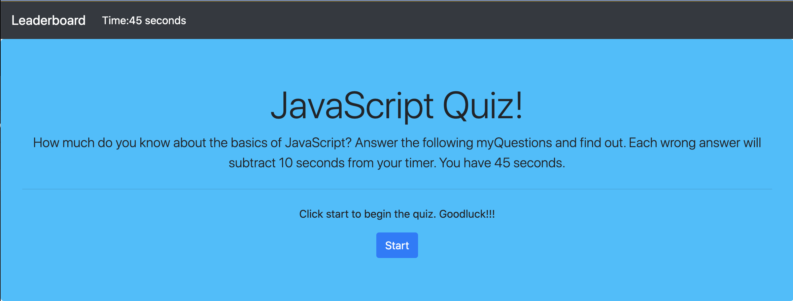
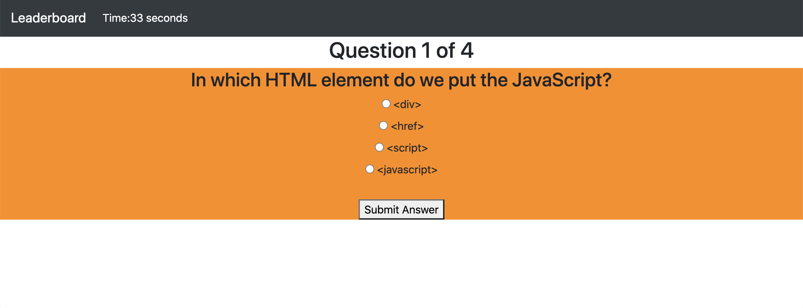
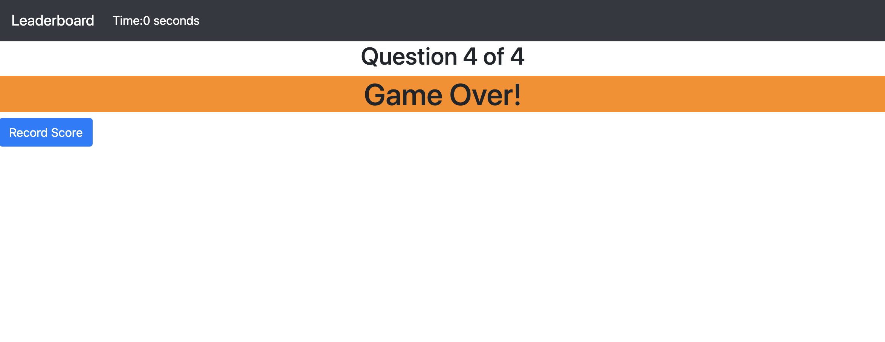
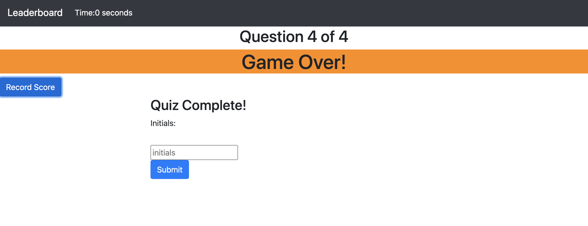

# code-quiz
It's funny how all the past assignments we have done seemed so hard at the time but when I've applied them to this current code quiz assignment and they all seem so much easier.  It seems as though my brain catches on to what we have done about a week later.  Hopefully that at least continues and doesn't get any slower.  

## HTML
I used bootstrap for most of my index.html.  I added a navbar at the top which conains the leaderboard link (which I can't get to work yet), and the timer.  Then I used a jumbotron for the quiz instructions and the start button.  I then used a form to submit initials and scores.  

I made a new html file for the leaderboard (recommended by my tutor) but now I can't seem to get it to link to my leaderboard link and input the scores and initials.  When I can get it to work I will change the card from bootstrap to a table so it is easier to read and can have more scores listed.  

## JS
I put my questions into an array and then called them in a function called renderQuestion.  I then used a function called checkAnswer to check the answers and see if they were correct.  Once all questions were answered it went to the finishQuiz function.  The finish quiz function stopped the time, made the high score however many seconds they had left.  It then displayed the recored score button.  That button took the user to the form to submit their initials.  They then type their initials and...... then I can't get it to connect to the leaderboard.  

My timer function is set for 45 seconds.  Each incorrect answer subtracts 10 seconds from the clock.  

